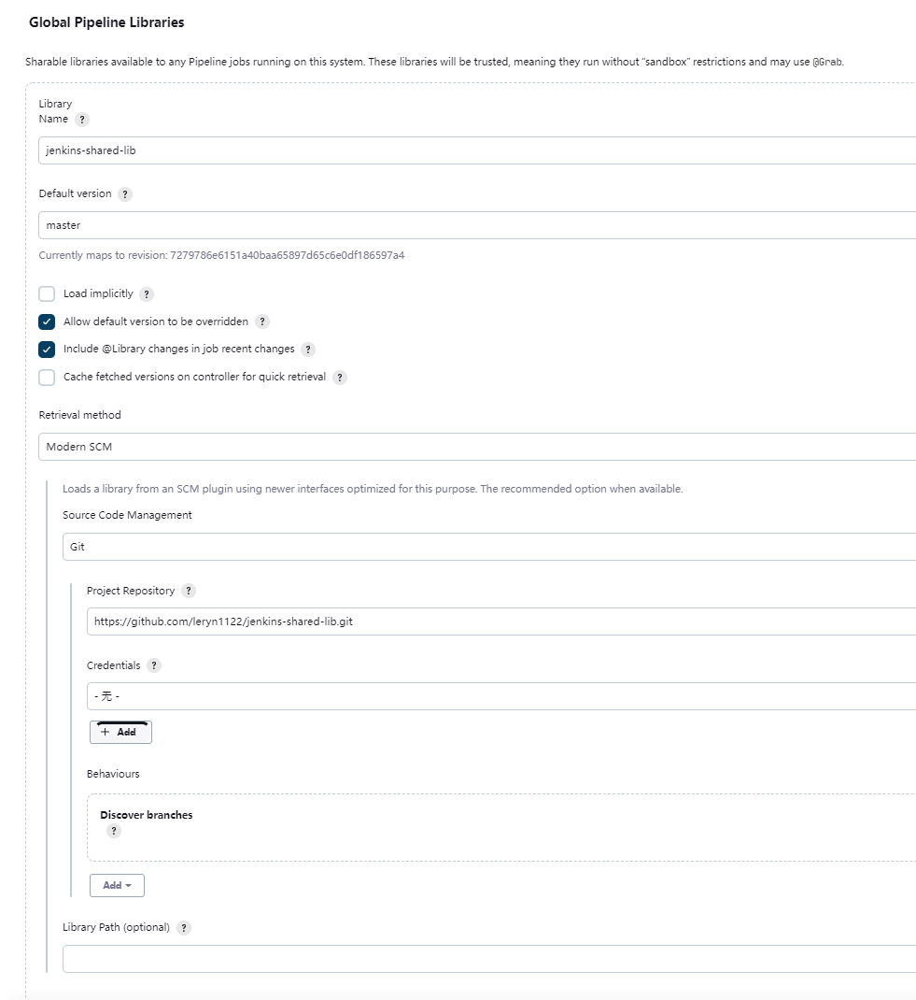

# 🤖 Jenkins-shared-lib

Jenkins shared library

## TL;DR

Language: Groovy

## Requisition

### Develop

- Groovy SDK
- (*Optional**) A preferred IDE (e.g. Jetbrains Intellij.).

### Runtime

- A Jenkins runtime with Groovy core plugins.

## Project Structure

The standard project structure is given below which references on [shared library docs](https://www.jenkins.io/doc/book/pipeline/shared-libraries)

```plaintext
(root)
+- src                     # Groovy source files
|   +- org
|       +- foo
|           +- Bar.groovy  # for org.foo.Bar class
+- vars 
|   +- foo.groovy          # for global 'foo' variable
|   +- foo.txt             # help for 'foo' variable
+- resources               # resource files (external libraries only)
|   +- org
|       +- foo
|           +- bar.json    # static helper data for org.foo.Bar
```

Using `gradlew` to organize the project:

## Configure as Pipeline Library on Jenkins

Example for **Global Pipeline Libraries** is given below.
The configuration on **Folder-level Shared Libraries** or **Automatic Shared Libraries**
is the same.

> 
> [ Manage Jenkins ] => [ Configure System ] => [ Global Pipeline Libraries ]
> 
> Library Name: jenkins-shared-lib
> 
> Project Repository: https://github.com/leryn1122/jenkins-shared-lib.git
>

<details>
<summary>See details</summary>
<div>



</div>
</details>

Or using [JCasC (Jenkins Configuration as Code)](https://www.jenkins.io/projects/jcasc/) plugin as followed:

```yaml
unclassified:
  globalLibraries:
    libraries:
    - defaultVersion: "master"
      name: "jenkins-shared-lib"
      retriever:
        modernSCM:
          scm:
            git:
              id: "5844ccd2-4580-4e81-ba5b-f63533368fef"
              remote: "https://github.com/leryn1122/jenkins-shared-lib.git"
              traits:
              - "gitBranchDiscovery"
```

When configured, import the library in your pipeline through such statement:

```groovy
@Library("jenkins-shared-lib") _
```

## Related Efforts

Serve for Jenkins pipeline project.

- [Jenkins Pipeline](https://github.com/leryn1122/jenkins-pipeline)

## Reference Docs

- [Jenkins shared library docs](https://www.jenkins.io/doc/book/pipeline/shared-libraries)
- [JenkinsPipelineUnit - github/jenkinsci](https://github.com/jenkinsci/JenkinsPipelineUnit)